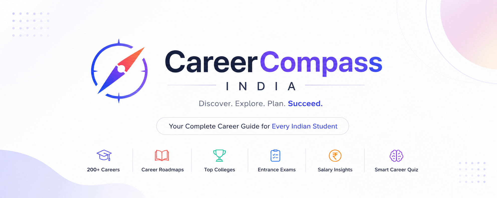
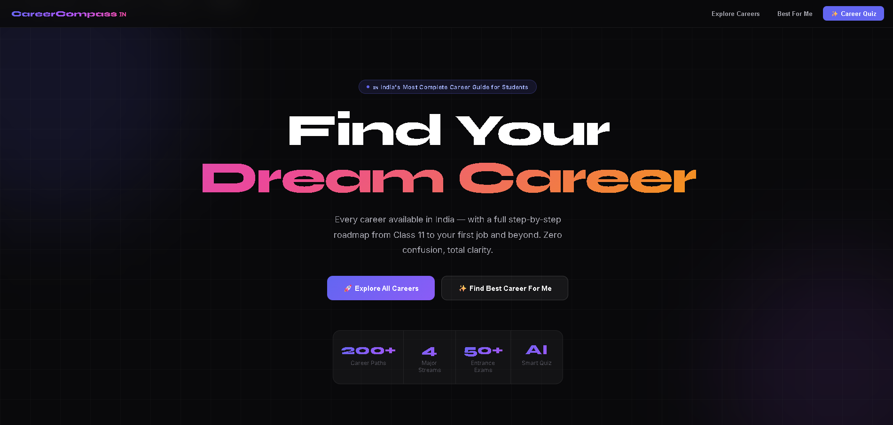
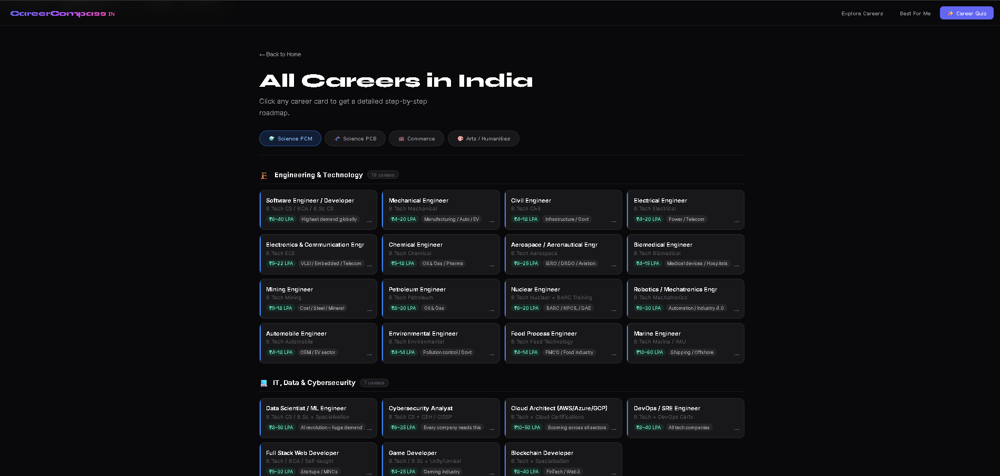
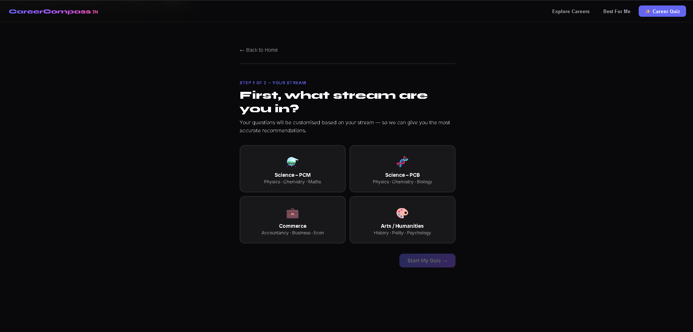
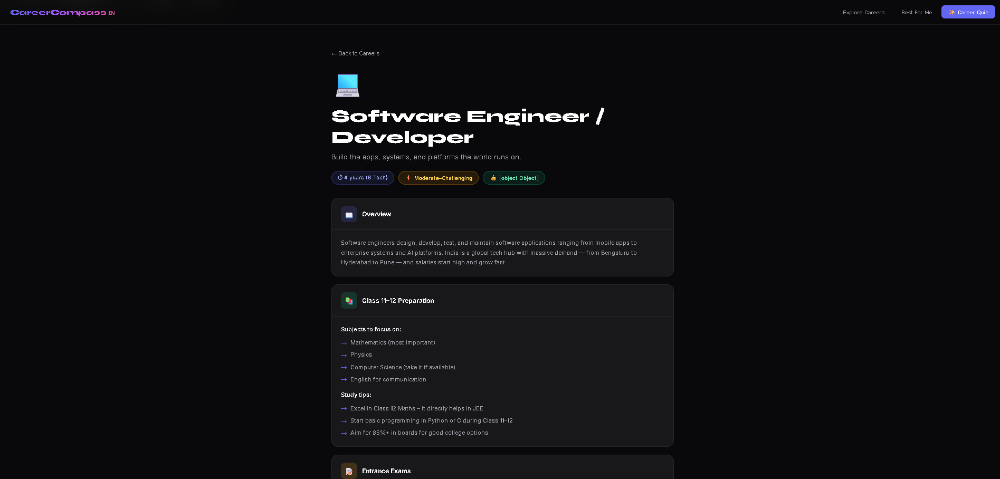

<div align="center">

  

# 🎓 CareerCompass India

### *Your Complete Career Guide for Every Indian Student*

<p>
  <strong>Discover Careers • Explore Roadmaps • Prepare for Exams • Build Your Future</strong>
</p>

<p>


</p>

<p>

**🚀 200+ Career Paths**

**🧠 Smart Career Quiz**

**📚 Complete Career Roadmaps**

**🏫 Top Colleges**

**📝 Entrance Exams**

**💼 Salary Insights**

</p>

---

### ⭐ If you like this project, please consider giving it a Star!

</div>

---

# 📖 Overview

Choosing a career after Class 10 or Class 12 can be confusing.

**CareerCompass India** is designed to solve this problem by providing students with everything they need in one place—from selecting a stream to landing their dream career.

The application includes:

* Interactive Career Explorer
* Smart Career Recommendation Quiz
* Detailed Career Roadmaps
* Entrance Exam Guide
* Salary Insights
* College Recommendations
* Future Career Scope
* Modern Responsive Interface

---

# ✨ Features

## 🎯 Career Explorer

Browse careers from all major academic streams.

| Stream           | Careers                                                     |
| ---------------- | ----------------------------------------------------------- |
| ⚗️ Science (PCM) | Engineering, AI, Software, Defence, Aviation, Architecture  |
| 🧬 Science (PCB) | MBBS, Pharmacy, Nursing, Biotechnology, Agriculture         |
| 💼 Commerce      | CA, CS, Banking, MBA, Finance, Entrepreneurship             |
| 🎨 Arts          | Law, UPSC, Journalism, Psychology, Design, Hotel Management |

---

## 🧠 Smart Career Quiz

The built-in quiz analyzes:

* Academic Stream
* Interests
* Personality
* Strengths
* Career Goals

and recommends the best matching careers.

---

## 📚 Career Roadmaps

Every roadmap includes:

✅ Subjects

✅ Entrance Exams

✅ Top Colleges

✅ Degree Path

✅ Skills Required

✅ Certifications

✅ Companies

✅ Salary Progression

✅ Career Timeline

---

## 💰 Salary Insights

CareerCompass provides estimated salary ranges for:

* Freshers
* Mid-Level Professionals
* Senior Professionals

---

## 🏫 Top Colleges

Recommendations include institutes such as:

* IITs
* NITs
* AIIMS
* BITS Pilani
* IIMs
* IIITs
* NIFT
* NID
* National Law Universities
* and many more.

---

# 🛠 Tech Stack

| Frontend | Styling | Language         |
| -------- | ------- | ---------------- |
| HTML5    | CSS3    | JavaScript (ES6) |

### Design

* Responsive Layout
* Glassmorphism UI
* Dark Theme
* CSS Animations
* Single Page Application
* Mobile Friendly

---

# 📸 Screenshots

## 🏠 Home



---

## 📚 Career Explorer



---

## 🧠 Career Quiz



---

## 🛣 Career Roadmap



---

# 🌟 Upcoming Features

* 🤖 AI Career Counsellor
* 🔍 Search Careers
* ❤️ Bookmark Careers
* 🔐 Authentication
* ☁ Cloud Database
* 📊 Career Comparison
* 🎓 Scholarship Finder
* 🏛 College Predictor
* 🌐 Multi-language Support
* 📱 Progressive Web App (PWA)

---

# 🤝 Contributing

Contributions are welcome!

```text
Fork Repository

↓

Create Feature Branch

↓

Commit Changes

↓

Push Branch

↓

Open Pull Request
```

---

# 💡 Why CareerCompass?

Unlike traditional career websites,

CareerCompass combines:

* Beautiful UI
* Interactive Experience
* Career Discovery
* Exam Preparation
* College Information
* Salary Insights
* Smart Recommendations

all inside one lightweight web application.

---

# 📈 Future Vision

Our mission is to become the most comprehensive free career guidance platform for students across India.

---

# 👨‍💻 Author

## Ayush Pawar

Passionate about Web Development, UI/UX Design, and building educational tools that help students make informed career decisions.

---

# ⭐ Support

If this project helped you,

please consider

⭐ Starring the repository

🍴 Forking it

🐛 Reporting bugs

💡 Suggesting features

❤️ Sharing it with friends

---

<div align="center">

## 🌟 Thanks for Visiting!

### Built with ❤️ for Students Across India 🇮🇳

*"Helping students choose careers with confidence."*

</div>
